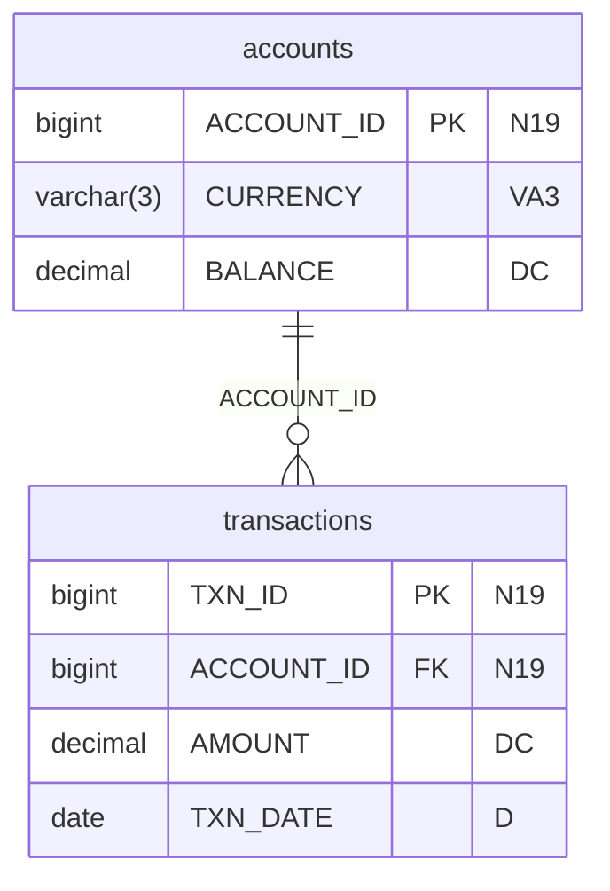

# FDL Synthetic Data Platform — Complete Beginner's Guide

> **Who is this for?** Anyone joining the project who has never used this tool before.
> After reading this you will be able to generate realistic test data, scan for PII,
> infer configs from real files, upload to the cloud, and understand every feature.

---

## Table of Contents

1. [What problem does this solve?](#1-what-problem-does-this-solve)
2. [How it works — the big picture](#2-how-it-works--the-big-picture)
3. [Installation](#3-installation)
4. [Your first data generation — 5 minutes](#4-your-first-data-generation--5-minutes)
5. [Config files — telling the tool what to generate](#5-config-files--telling-the-tool-what-to-generate)
6. [Making data realistic — Special Rules](#6-making-data-realistic--special-rules)
7. [Relationships between tables](#7-relationships-between-tables)
8. [Delta — tracking what changed](#8-delta--tracking-what-changed)
9. [SCD2 — full history tables](#9-scd2--full-history-tables)
10. [AI Feature 1 — Auto-Config from a real data file](#10-ai-feature-1--auto-config-from-a-real-data-file)
11. [AI Feature 2 — PII Detection](#11-ai-feature-2--pii-detection)
12. [AI Feature 3 — Statistical Distribution Fitting](#12-ai-feature-3--statistical-distribution-fitting)
13. [ER Diagram generation](#13-er-diagram-generation)
14. [Cloud Upload — Azure and AWS S3](#14-cloud-upload--azure-and-aws-s3)
15. [Collibra Import](#15-collibra-import)
16. [LLM-Assisted features](#16-llm-assisted-features)
17. [Performance — what makes it fast](#17-performance--what-makes-it-fast)
18. [Wire Mock compatibility](#18-wire-mock-compatibility)
19. [Command cheat sheet](#19-command-cheat-sheet)

---

## 1. What problem does this solve?

### The problem

You are building or testing a financial application. You need database tables filled
with realistic data — IBANs, transaction amounts, account IDs, booking dates — but:

- You cannot use real customer data (GDPR / privacy)
- Hand-crafting 10,000 rows in Excel takes days
- Random garbage data (`AAABBB`, `12345`) breaks your validations immediately
- Your tables are linked: a `transaction` row must reference a valid `account` row

### The solution

This platform reads a simple config file that describes your tables and columns,
then generates as many rows as you need that look and behave like real data —
correct formats, realistic values, valid foreign keys, date ranges, and all.

```
config/my_tables.yaml   ──►   generator   ──►   output/
                                                  ├── accounts.parquet
                                                  ├── transactions.parquet
                                                  └── fx_rates.parquet
```

---

## 2. How it works — the big picture

```
┌─────────────────────────────────────────────────────┐
│  Config File (Excel or YAML)                        │
│  "I have a table called ACCOUNTS with columns       │
│   ACCOUNT_ID (PK), IBAN, CUSTOMER_NAME, BALANCE..." │
└──────────────────────┬──────────────────────────────┘
                       │
                       ▼
┌─────────────────────────────────────────────────────┐
│  ConfigParser                                       │
│  Reads the file, validates it, builds internal      │
│  column/table/relationship model objects            │
└──────────────────────┬──────────────────────────────┘
                       │
                       ▼
┌─────────────────────────────────────────────────────┐
│  DataGenerator — two paths                          │
│                                                     │
│  Path A: SDV (Synthetic Data Vault)                 │
│    Trains a machine-learning model on a small       │
│    internal sample, then samples full data from it  │
│                                                     │
│  Path B: Rule-based fallback (always available)     │
│    Uses Faker, regex patterns, value lists,         │
│    date ranges, and 60+ special rules               │
└──────────────────────┬──────────────────────────────┘
                       │
                       ▼
┌─────────────────────────────────────────────────────┐
│  Export to Parquet                                  │
│  Arrow type casting, correct column types,          │
│  FK resolution, PK uniqueness guarantee             │
└─────────────────────────────────────────────────────┘
```

---

## 3. Installation

```bash
# 1. Install Poetry (dependency manager) if you don't have it
pip install poetry

# 2. Install all dependencies
poetry install

# 3. Verify it works
poetry run python main.py --help
```

Expected output:
```
usage: main.py [-h] {generate,delta,scd2,lint,enrich,collibra-import,infer-config,pii-scan} ...

SDV-Based Test Data Generator with snapshot, delta, and SCD2 flows
```

### Optional extras (install only what you need)

```bash
pip install azure-storage-blob   # if you want --upload-to azure://...
pip install boto3                # if you want --upload-to s3://...
pip install matplotlib           # if you want --er-format png
```

---

## 4. Your first data generation — 5 minutes

### Step 1 — Write a minimal YAML config

Create `config/my_first.yaml`:

```yaml
config_format: fdl-yaml-v1

run_settings:
  default_records_per_table: 100

tables:
  - name: customers
    rows: 100
    columns:
      - name: CUSTOMER_ID
        type: N19
        pk: true

      - name: FULL_NAME
        type: VA256
        special_rules: NAME

      - name: EMAIL
        type: VA256
        special_rules: EMAIL

      - name: ACCOUNT_BALANCE
        type: DC
        min: 100.00
        max: 50000.00
```

### Step 2 — Generate

```bash
python main.py generate --config config/my_first.yaml --output output/first_run
```

### Output you will see

```
SDV Test Data Generator
==================================================
Configuration file: config/my_first.yaml
Output directory:   output/first_run

Generation settings:
  Total tables to generate: 1
  Seed: (random)

Training SDV synthesizer...
  Initializing HMA Synthesizer...

Generating 100 records for customers (requested: 100)
  PK uniqueness verified for customers.CUSTOMER_ID (100/100 unique)

Exporting to output/first_run...
  Exported customers.parquet (100 records)

Successfully exported 1 file with 100 total records
Generation Report:
  Total records: 100
  File records verified: 100
  Synthesizer fitted: True

All files saved to: output/first_run
```

### Step 3 — Inspect the result

```bash
poetry run python readParquet.py output/first_run
```

Sample output:
```
=== customers.parquet ===
Rows: 100  Columns: 4

   CUSTOMER_ID          FULL_NAME                     EMAIL  ACCOUNT_BALANCE
0  10000000001      Jan de Vries      jan.devries@gmail.com         12847.50
1  10000000002     Maria Schmidt   m.schmidt@hotmail.com            834.20
2  10000000003      Anna Johnson   anna.j@outlook.com              44521.75
3  10000000004       Li Wei Chen   liwei.chen@yahoo.com             5102.00
```

That's it — realistic names, emails, balances, and a unique PK. All in 3 lines of config.

---

## 5. Config files — telling the tool what to generate

You have two formats: **Excel** and **YAML**. Both do the same thing.

### Excel format

An Excel workbook with up to 4 sheets:

| Sheet | Required? | What it does |
|---|---|---|
| `Columns` | **Yes** | One row per column — the main definition |
| `Run_Settings` | No | Global settings like record count |
| `Tables` | No | Per-table settings |
| `Relationships` | No | FK links between tables |

**Columns sheet** — key columns:

| Column | Example | Meaning |
|---|---|---|
| `TABLE_NAME` | `ACCOUNTS` | Which table this column belongs to |
| `COLUMN_NAME` | `ACCOUNT_ID` | Column name |
| `DATA_TYPE` | `N19` | Type code (see below) |
| `IS_PK` | `Y` | Is this a primary key? |
| `IS_FK` | `Y` | Is this a foreign key? |
| `REF_TABLE` | `CUSTOMERS` | Parent table (for FK) |
| `REF_COLUMN` | `CUSTOMER_ID` | Parent column (for FK) |
| `business_values` | `EUR;USD;GBP` | Allowed values (semicolon-separated) |
| `special_rules` | `EMAIL` | Generation rule keyword |
| `min` | `1000` | Minimum value |
| `max` | `9999` | Maximum value |
| `nullable` | `Y` | Can this be null? |

### YAML format

Same information, but as a text file — easier for version control and automation.

```yaml
config_format: fdl-yaml-v1

run_settings:
  default_records_per_table: 1000

tables:
  - name: accounts
    rows: 500
    columns:
      - name: ACCOUNT_ID
        type: N19
        pk: true

      - name: IBAN
        type: VA34
        special_rules: IBAN

      - name: CURRENCY
        type: VA3
        values: EUR;USD;GBP;CHF

      - name: BALANCE
        type: DC
        min: 0.00
        max: 1000000.00
        nullable: false
```

### Data types

| Code | What it is | Example value |
|---|---|---|
| `N` | Small integer | `42` |
| `N19` | Big integer (up to 19 digits) | `1234567890123` |
| `N38` | Very large integer | `99999999999999999999` |
| `DC` | Decimal number | `1234.56` |
| `D` | Date | `2024-03-15` |
| `DT` | Date + time | `2024-03-15 14:30:00` |
| `TS` | Timestamp with timezone | `2024-03-15 14:30:00 UTC` |
| `VA1` | 1-character string | `Y` |
| `VA3` | 3-character string | `EUR` |
| `VA18` | 18-character string | `NL91ABNA0417164300` |
| `VA50` | Up to 50 characters | `ACME Corporation` |
| `VA256` | Up to 256 characters | long text |
| `A1` | Single letter/flag | `Y` or `N` |

---

## 6. Making data realistic — Special Rules

Without `special_rules`, names look like `word1234`, emails look like `aaabbb`. Special rules fix this.

### How to use

In YAML:
```yaml
- name: CUSTOMER_EMAIL
  type: VA256
  special_rules: EMAIL
```

In Excel: put `EMAIL` in the `special_rules` column for that row.

### Personal data

```yaml
# Full name: "Jan de Vries", "Maria Schmidt", "Tanaka Yuki"
special_rules: NAME

# First name only: "Jan", "Maria", "Tanaka"
special_rules: FIRST_NAME

# Last name only: "de Vries", "Schmidt", "Tanaka"
special_rules: LAST_NAME

# Email: "jan.devries@gmail.com"
special_rules: EMAIL

# Phone: "+31612345678"
special_rules: PHONE

# Full address: "Hoofdstraat 1, 1234 AB Amsterdam"
special_rules: ADDRESS

# Company name: "FDL Solutions B.V."
special_rules: COMPANY
```

### International / global data

Add `:locale` to get a specific country's format:

```yaml
# German name: "Hans Müller"
special_rules: NAME:de_DE

# French email: "jean.dupont@laposte.fr"
special_rules: EMAIL:fr_FR

# Brazilian name: "João Silva"
special_rules: NAME:pt_BR

# Japanese name: "田中太郎"
special_rules: NAME:ja_JP
```

Supported locales: `en_US`, `en_GB`, `en_AU`, `en_CA`, `de_DE`, `fr_FR`, `es_ES`,
`it_IT`, `nl_NL`, `pt_BR`, `ja_JP`, `zh_CN`, `ko_KR`, `ru_RU`, `pl_PL`, `tr_TR`,
`sv_SE`, `da_DK`

Use `GLOBAL_*` to get a **different random country on every row**:

```yaml
# Each row gets a name from a random country
special_rules: GLOBAL_NAME

# Same for addresses, phone numbers, companies
special_rules: GLOBAL_ADDRESS
special_rules: GLOBAL_PHONE
special_rules: GLOBAL_COMPANY
```

### Banking

```yaml
# IBAN (any SEPA country): "NL91ABNA0417164300"
special_rules: IBAN

# IBAN for a specific country: "DE89370400440532013000"
special_rules: IBAN:de_DE

# SWIFT/BIC (international, any bank): "ABNANL2A"
special_rules: SWIFT

# US ABA routing number: "021000021"
special_rules: US_ROUTING

# US bank account number: "1234567890"
special_rules: US_ACCOUNT

# UK sort code: "20-00-00"
special_rules: UK_SORTCODE

# UK account number: "12345678"
special_rules: UK_ACCOUNT

# Australian BSB: "062-000"
special_rules: AU_BSB

# Indian IFSC: "SBIN0000001"
special_rules: IN_IFSC

# Mexican CLABE (18 digits): "646180110400000007"
special_rules: CLABE

# Canadian transit: "00610-003"
special_rules: CA_TRANSIT
```

### National identifiers

```yaml
special_rules: SSN           # US Social Security: "123-45-6789"
special_rules: UK_NI         # UK National Insurance: "AB123456C"
special_rules: IN_PAN        # India PAN: "ABCDE1234F"
special_rules: IN_AADHAAR    # India Aadhaar: "1234 5678 9012"
special_rules: AU_TFN        # Australia Tax File: "123 456 782"
special_rules: BR_CPF        # Brazil individual tax: "111.444.777-35"
special_rules: BR_CNPJ       # Brazil company tax: "11.222.333/0001-81"
special_rules: FR_SIREN      # France company ID: "123456789"
special_rules: SG_NRIC       # Singapore NRIC: "S1234567D"
special_rules: ZA_ID         # South Africa ID: "8001015009087"
```

### Government documents

```yaml
special_rules: PASSPORT          # Random country passport
special_rules: PASSPORT:US       # US passport: "123456789"
special_rules: PASSPORT:DE       # German passport: "C01X00T47"
special_rules: DRIVERS_LICENCE   # Driving licence
special_rules: DRIVERS_LICENCE:US
```

### Tax & VAT

```yaml
special_rules: EU_VAT        # EU VAT (random member state): "DE123456789"
special_rules: EU_VAT:FR     # French VAT: "FR12345678901"
special_rules: GSTIN         # Indian GST: "27AAPFU0939F1ZV"
```

### Network & tech

```yaml
special_rules: IPV4     # "192.168.1.42"
special_rules: IPV6     # "2001:db8::1"
special_rules: MAC      # "00:1A:2B:3C:4D:5E"
special_rules: UUID     # "550e8400-e29b-41d4-a716-446655440000"
special_rules: URL      # "https://example.com/path"
```

### Healthcare

```yaml
special_rules: NHS_NUMBER               # UK: "943 476 5919"
special_rules: AU_MEDICARE              # Australia: "2123456701"
special_rules: DE_KRANKENVERSICHERUNG   # Germany: "A123456780"
special_rules: US_NPI                   # US provider: "1234567893"
```

### Crypto & product codes

```yaml
special_rules: BTC_ADDRESS   # Bitcoin address
special_rules: ETH_ADDRESS   # Ethereum address
special_rules: EAN13         # Barcode: "5901234123457"
special_rules: ISBN13        # Book ISBN: "9780306406157"
special_rules: CN_USCC       # China business code: "91110000600099792F"
```

### Regex patterns

For custom formats, write a regex:

```yaml
# Bank reference: "REF-2024-0042"
special_rules: "REGEX:REF-20[0-9]{2}-[0-9]{4}"

# Postal code: "1234 AB"
special_rules: "REGEX:[1-9][0-9]{3} [A-Z]{2}"

# Product code: "PROD-ABC-123"
special_rules: "REGEX:PROD-[A-Z]{3}-[0-9]{3}"
```

### Controlling nulls

Add `NULL_RATE` to any rule:

```yaml
# 30% of rows will be null
special_rules: "EMAIL;;NULL_RATE=0.3"

# 15% of rows will be null (percentage syntax)
special_rules: "PHONE;;NULL_PCT=15"
```

### Full realistic example config

```yaml
config_format: fdl-yaml-v1

tables:
  - name: global_customers
    rows: 1000
    columns:
      - name: CUSTOMER_ID
        type: N19
        pk: true

      - name: FULL_NAME
        type: VA256
        special_rules: GLOBAL_NAME          # different country every row

      - name: EMAIL
        type: VA256
        special_rules: EMAIL

      - name: PHONE
        type: VA20
        special_rules: GLOBAL_PHONE
        nullable: true

      - name: IBAN
        type: VA34
        special_rules: IBAN

      - name: BIC
        type: VA11
        special_rules: SWIFT

      - name: PASSPORT_NO
        type: VA20
        special_rules: PASSPORT

      - name: STATUS
        type: VA10
        values: ACTIVE;INACTIVE;PENDING;SUSPENDED

      - name: BALANCE
        type: DC
        min: 0.00
        max: 500000.00

      - name: CREATED_DATE
        type: D
        min: "2020-01-01"
        max: "2024-12-31"
```

Generate:
```bash
python main.py generate --config config/global_customers.yaml --output output/customers
```

Sample output rows:
```
CUSTOMER_ID  FULL_NAME            EMAIL                    IBAN                   STATUS   BALANCE    CREATED_DATE
10000000001  Hans Müller          hans@example.de          DE89370400440532013000 ACTIVE   84320.50   2021-06-14
10000000002  Tanaka Hiroshi       t.hiroshi@mail.jp        NL91ABNA0417164300     PENDING  1204.00    2023-11-02
10000000003  Jean-Pierre Dupont   jp.dupont@laposte.fr     FR7614508359952412548  ACTIVE   250000.75  2020-03-28
```

---

## 7. Relationships between tables

Real databases have tables that reference each other. A transaction must point to a
real account. The generator handles this automatically.

### Example: accounts → transactions

```yaml
config_format: fdl-yaml-v1

tables:
  - name: accounts
    rows: 100
    columns:
      - name: ACCOUNT_ID
        type: N19
        pk: true
      - name: CURRENCY
        type: VA3
        values: EUR;USD;GBP

  - name: transactions
    rows: 500
    columns:
      - name: TXN_ID
        type: N19
        pk: true
      - name: ACCOUNT_ID        # ← FK to accounts
        type: N19
        fk: true
        ref_table: accounts
        ref_column: ACCOUNT_ID
      - name: AMOUNT
        type: DC
        min: 1.00
        max: 10000.00
      - name: TXN_DATE
        type: D
        min: "2024-01-01"
        max: "2024-12-31"

relationships:
  - source_table: transactions
    source_column: ACCOUNT_ID
    target_table: accounts
    target_column: ACCOUNT_ID
    relationship_type: one_to_many
```

Result:
- 100 unique accounts are generated
- 500 transactions are generated, each with `ACCOUNT_ID` pointing to one of those 100 accounts
- Referential integrity is **guaranteed** — no orphan transactions

---

## 8. Delta — tracking what changed

The delta command compares two snapshots and tells you what was **inserted**, **updated**,
or **deleted** between them. Used in ETL pipelines and CDC (Change Data Capture) testing.

### Step-by-step

```bash
# 1. Generate snapshot V1 (say, Monday's data)
python main.py generate --config config/accounts.yaml --output output/snap_v1 --seed 1

# 2. Generate snapshot V2 (Tuesday's data — different seed = different rows)
python main.py generate --config config/accounts.yaml --output output/snap_v2 --seed 2

# 3. Compute what changed
python main.py delta \
    --config config/accounts.yaml \
    --previous output/snap_v1 \
    --current output/snap_v2 \
    --output output/delta_run
```

### Output structure

```
output/delta_run/
  accounts/
    YEAR_MONTH=202412/
      part-0001.parquet       ← rows that changed
```

Each row in the delta file has an extra `operation` column:
- `I` — Inserted (new row in V2, not in V1)
- `U` — Updated (same PK, different values)
- `D` — Deleted (was in V1, gone from V2)

### What you get

```
ACCOUNT_ID   CURRENCY   BALANCE    operation
10000000003  USD        44521.75   I          ← new account
10000000007  EUR        1200.00    U          ← balance changed
10000000015  GBP        830.50     D          ← account deleted
```

### Understanding partition folder names

The delta output is partitioned into folders like `YEAR_MONTH=202412`. Two cases:

**Case 1 — Your data has a `YEAR_MONTH` column:**
The folder name comes from the actual values in that column.
```
YEAR_MONTH = 202412  →  folder is YEAR_MONTH=202412
YEAR_MONTH = 202501  →  folder is YEAR_MONTH=202501
```

**Case 2 — No such column in your data:**
The folder is auto-created with today's date in `YYYYMMDD` format as `edl_partition_date`.
```
edl_partition_date=20241215/   ← auto-generated partition
```

---

## 9. SCD2 — full history tables

SCD2 (Slowly Changing Dimension Type 2) keeps the full history of every change,
not just the latest state. Every version of a row is preserved with effective dates.

```bash
python main.py scd2 \
    --config config/accounts.yaml \
    --previous output/snap_v1 \
    --current output/snap_v2 \
    --output output/scd2_run
```

### What you get

Each historical version of a row gets extra columns:

```
ACCOUNT_ID  BALANCE  effective_from_ts    effective_to_ts      is_current  version_num
1001        800.00   2024-01-01 00:00:00  2024-06-15 12:00:00  false       1
1001        1200.00  2024-06-15 12:00:00  9999-12-31 23:59:59  true        2
```

This lets you answer: "What was the balance of account 1001 on 1st March 2024?"
Answer: query where `effective_from_ts <= '2024-03-01' AND effective_to_ts > '2024-03-01'`

### Enable SCD2 tracking in config

```yaml
tables:
  - name: accounts
    scd2_enabled: true
    scd2_tracked_columns:
      - BALANCE
      - STATUS
    columns:
      - name: ACCOUNT_ID
        type: N19
        pk: true
      - name: BALANCE
        type: DC
      - name: STATUS
        type: VA10
        values: ACTIVE;INACTIVE
```

Only `BALANCE` and `STATUS` changes trigger a new version. Changes to other columns
(like a phone number) don't.

---

## 10. AI Feature 1 — Auto-Config from a real data file

**Problem:** You have a real data file (CSV, Parquet, or Excel) and want to generate
synthetic versions of it — but you don't want to write the config by hand.

**Solution:** `infer-config` reads the file and writes the config for you.

### Usage

```bash
python main.py infer-config \
    --input data/real_customers.csv \
    --output config/customers_auto.yaml
```

### What it does automatically

1. **Reads the file** (up to 5,000 rows as a sample)
2. **Infers data types** from actual values:
   - `42` → `N`
   - `1234567890123` → `N19`
   - `1234.56` → `DC`
   - `2024-03-15` → `D`
   - `jan@example.com` → `VA256`
3. **Detects primary keys** — columns that are 100% unique and never null
4. **Captures business values** for low-cardinality columns like status codes
5. **Computes min/max** for numeric and date columns
6. **Fits a statistical distribution** to numeric columns (so generated values have
   the same shape as real ones — not just random)
7. **Detects PII columns** and suggests the right `special_rules` keyword

### Example

Input CSV (`real_customers.csv`):
```
customer_id,full_name,email,account_balance,status,created_date
1001,Jan de Vries,jan@example.nl,12847.50,ACTIVE,2021-06-14
1002,Maria Schmidt,m.schmidt@web.de,834.20,INACTIVE,2023-11-02
1003,Anna Johnson,anna@gmail.com,44521.75,ACTIVE,2020-03-28
...
```

Command:
```bash
python main.py infer-config --input real_customers.csv --output config/auto.yaml
```

Output on screen:
```
  WARNING: customers.email: likely EMAIL (95%) → special_rules: EMAIL
  WARNING: customers.full_name: likely NAME (80%) → special_rules: NAME

Config written to: config/auto.yaml
  Table: real_customers | 6 column(s) inferred
  2 column(s) flagged as PII -- review _pii_note fields

Next step:
  python main.py generate --config config/auto.yaml --output output/snapshot_v1
```

Generated `config/auto.yaml`:
```yaml
config_format: fdl-yaml-v1
run_settings:
  default_records_per_table: 1000
tables:
- name: real_customers
  rows: 1000
  columns:
  - name: CUSTOMER_ID
    type: N
    pk: true
  - name: FULL_NAME
    type: VA256
    special_rules: NAME
    _pii_note: NAME detected (conf=80%) — review and remove _pii_note before committing
  - name: EMAIL
    type: VA256
    special_rules: EMAIL
    _pii_note: EMAIL detected (conf=95%) — review and remove _pii_note before committing
  - name: ACCOUNT_BALANCE
    type: DC
    min: 834.2
    max: 44521.75
    distribution:
      name: lognorm
      params: [0.85, 0.0, 8200.0]
      ks_stat: 0.042
      data_min: 834.2
      data_max: 44521.75
  - name: STATUS
    type: VA10
    values: ACTIVE;INACTIVE
  - name: CREATED_DATE
    type: D
    min: '2020-03-28'
    max: '2023-11-02'
```

Notice:
- `STATUS` was auto-detected as low-cardinality → captured as `values:`
- `ACCOUNT_BALANCE` got a `lognorm` distribution fitted to it — generated values
  will have the same statistical shape as the real data (skewed right, as balances are)
- PII columns got `_pii_note` markers — human reviews and removes before committing
- `CREATED_DATE` got min/max from real data

Then generate:
```bash
python main.py generate --config config/auto.yaml --output output/synthetic
```

### Flags

```bash
--no-distributions    # Skip scipy fitting (faster)
--no-pii-scan         # Skip PII detection
--pii-confidence 0.8  # Only flag columns with ≥80% confidence
--sample-size 2000    # Use only 2000 rows for inference
--table-name orders   # Override the table name
```

---

## 11. AI Feature 2 — PII Detection

**Problem:** You have a Parquet file or a config and want to know: "does this contain
columns that might hold personal or sensitive data?"

**Solution:** `pii-scan` inspects column names and sampled values against 50+ rules.

### Scan a data file

```bash
python main.py pii-scan --input output/snapshot_v1/transactions.parquet
```

### Scan a config file (no data needed)

```bash
python main.py pii-scan --input config/my_config.yaml
```

### Example output

```
WARNING  PII scan — 4 finding(s)

MEDIUM (3)
  transactions.ACCOUNT_ID  [IBAN]  conf=95%  → add special_rules: IBAN
    ↳ 100% of sampled values match IBAN pattern
  transactions.COUNTERPARTY_IBAN  [IBAN]  conf=98%  → add special_rules: IBAN
    ↳ column name matches /iban/
  transactions.AGENT_BIC  [SWIFT_BIC]  conf=92%  → add special_rules: SWIFT
    ↳ column name matches /swift|bic.?(code)?/
LOW (1)
  transactions.COUNTERPARTY_NAME  [COMPANY]  conf=65%  → add special_rules: COMPANY
    ↳ column name matches /company|employer|org(anization|isation)?/
```

### What each finding means

- **IBAN** at 95% confidence on `ACCOUNT_ID` — the actual values in that column
  match the IBAN format pattern (the tool sampled 30 values and 100% matched)
- **SWIFT_BIC** at 92% — the column name `AGENT_BIC` directly matches the BIC pattern
- **Suggestion** `→ add special_rules: IBAN` — copy this into your config so the
  generator creates proper IBANs instead of random strings

### Severity levels

| Level | Typical columns | Examples |
|---|---|---|
| 🔴 HIGH | Directly identifies a person | SSN, passport, AADHAAR, NHS number |
| 🟡 MEDIUM | Financial or contact data | IBAN, email, phone, BIC |
| 🔵 LOW | Indirectly identifying | company name, address, age |

### Flags

```bash
--confidence 0.8    # Only report findings above 80% confidence (default: 60%)
--sample-size 100   # Sample 100 values per column for value-based detection
```

---

## 12. AI Feature 3 — Statistical Distribution Fitting

This feature runs automatically when you use `infer-config`. It answers the question:
**"What shape does the data have?"** so generated values look statistically the same.

### The problem without distributions

Random generation for a balance column gives:
```
BALANCE: 1204.00, 48750.23, 23400.11, 31200.00, 5.42, 49999.00 ...
```
Uniform spread — equally likely to be any value from 0 to 50,000.

### Real financial balances are not uniform

Most customers have modest balances (< £5,000). A few have large ones (> £100,000).
This is called a **log-normal distribution** — common for monetary values.

### With distribution fitting

The fitter tests 5 candidate distributions against your real data and picks the best fit:

| Distribution | Best for |
|---|---|
| `norm` (normal) | Heights, measurement errors, symmetric data |
| `lognorm` (log-normal) | Balances, incomes, prices, transaction amounts |
| `expon` (exponential) | Time between events, waiting times |
| `gamma` | Counts, durations, rainfall |
| `uniform` | Anything else / flat distribution |

Selection uses the **KS test** (Kolmogorov-Smirnov) — lower is better. The winner
gets stored in your config:

```yaml
- name: ACCOUNT_BALANCE
  type: DC
  distribution:
    name: lognorm
    params: [0.85, 0.0, 8200.0]
    ks_stat: 0.042        # ← how well it fits (lower = better)
    data_min: 834.2
    data_max: 44521.75
```

When you generate data, the generator samples from this lognorm distribution instead
of uniform random — producing realistic balance distributions:

```
BALANCE (with dist):  8420.00, 3105.50, 12840.00, 1200.00, 24500.75  ← realistic
BALANCE (no dist):    1204.00, 48750.23, 23400.11, 31200.00, 5.42    ← flat/random
```

---

## 13. ER Diagram generation

After generating, you can automatically produce a diagram showing all tables, columns,
and FK relationships. Useful for documentation and onboarding.

### Usage

```bash
# Mermaid format (default — opens in VS Code, GitHub, Notion)
python main.py generate --config config/accounts.yaml --output output/run_01 --er-diagram

# Multiple formats at once
python main.py generate --config config/accounts.yaml --output output/run_01 \
    --er-diagram --er-format mermaid dot png
```

### What you get

**Mermaid (`.mmd`)** — text diagram that renders everywhere:


**PNG** — visual table boxes with column names, PK/FK labels, and arrows:
```
┌─────────────────────┐         ┌───────────────────────┐
│      accounts       │         │      transactions      │
├─────────────────────┤         ├───────────────────────┤
│ PK ACCOUNT_ID bigint│──────►  │ PK TXN_ID       bigint│
│    CURRENCY  varchar│         │ FK ACCOUNT_ID   bigint│
│    BALANCE  decimal │         │    AMOUNT      decimal│
└─────────────────────┘         │    TXN_DATE       date│
                                └───────────────────────┘
```

**DOT** — Graphviz format for large diagrams, renders with `dot -Tpng diagram.dot`

### How to view Mermaid

- **VS Code**: install the "Mermaid Preview" extension, open the `.mmd` file
- **GitHub**: paste the content in a README between ` ```mermaid ` and ` ``` `
- **Browser**: go to [https://mermaid.live](https://mermaid.live) and paste the content
- **Notion**: insert a "Code" block and select Mermaid

---

## 14. Cloud Upload — Azure and AWS S3

After generation, upload the output directory directly to cloud storage.

### Azure Blob Storage

```bash
# Step 1: set credentials (once, or in your CI/CD environment)
export AZURE_STORAGE_CONNECTION_STRING="DefaultEndpointsProtocol=https;AccountName=myaccount;..."

# Step 2: generate and upload in one command
python main.py generate \
    --config config/accounts.yaml \
    --output output/run_01 \
    --upload-to azure://my-container/synthetic-data/run_01
```

Output:
```
Uploading output/run_01 → azure://my-container/synthetic-data/run_01 ...
  Uploaded → azure://my-container/synthetic-data/run_01/accounts.parquet
  Uploaded → azure://my-container/synthetic-data/run_01/transactions.parquet
Upload complete: 2 file(s) uploaded to azure://my-container/synthetic-data/run_01
```

### AWS S3

```bash
export AWS_ACCESS_KEY_ID="AKIA..."
export AWS_SECRET_ACCESS_KEY="..."
export AWS_DEFAULT_REGION="eu-west-1"

python main.py generate \
    --config config/accounts.yaml \
    --output output/run_01 \
    --upload-to s3://my-data-bucket/synthetic/run_01
```

### URI format

```
azure://<container-name>/<folder/path>
s3://<bucket-name>/<folder/path>
```

### Azure credential options (priority order)

| Priority | How to set |
|---|---|
| 1 (preferred) | `AZURE_STORAGE_CONNECTION_STRING=...` |
| 2 | `AZURE_STORAGE_ACCOUNT=...` + `AZURE_STORAGE_KEY=...` |
| 3 | `AZURE_STORAGE_ACCOUNT=...` + `AZURE_STORAGE_SAS_TOKEN=...` |

### AWS credential options

Standard AWS credential chain — any of these works:
- Environment variables (`AWS_ACCESS_KEY_ID`, `AWS_SECRET_ACCESS_KEY`)
- Named profile (`AWS_PROFILE=myprofile`)
- IAM role (automatic on EC2, ECS, Lambda — nothing to configure)

---

## 15. Collibra Import

If your organisation uses the **Collibra data catalog**, you can import dataset
definitions directly instead of writing config files by hand.

### Prerequisites

```bash
export COLLIBRA_BASE_URL="https://your-org.collibra.com"
export COLLIBRA_USERNAME="service-account@company.com"
export COLLIBRA_PASSWORD="secret"
```

### Usage

```bash
# Find and import "Account Booking" dataset
python main.py collibra-import \
    --dataset "Account Booking" \
    --output config/account_booking.yaml
```

Output:
```
Searching Collibra for dataset: 'Account Booking' ...
Found asset id=abc-123-def. Fetching columns...
Collibra config written to config/account_booking.yaml (42 columns)
```

### Then generate

```bash
python main.py generate \
    --config config/account_booking.yaml \
    --output output/snapshot_v1 \
    --default-records 5000
```

### Advanced options

```bash
# Search within a specific domain
python main.py collibra-import \
    --dataset "Customer Master" \
    --domain "Finance" \
    --output config/customer.yaml

# Search for a specific asset type
python main.py collibra-import \
    --dataset "FX Rates" \
    --asset-type "Table" \
    --output config/fx_rates.yaml
```

### What gets imported

| Collibra attribute | Becomes in config |
|---|---|
| Display name | column `name` |
| Physical Data Type | `type` (mapped to FDL codes) |
| Nullable | `nullable: true/false` |
| Is Primary Key | `pk: true` |
| Description | `description` |

---

## 16. LLM-Assisted features

These features use the Claude AI model (requires `ANTHROPIC_API_KEY`).

### Relationship inference

If your config doesn't have relationships defined, Claude can look at your column names
and suggest which tables reference which.

```bash
export ANTHROPIC_API_KEY="sk-ant-..."

python main.py generate \
    --config config/bare_config.yaml \
    --output output/run_01 \
    --infer-relationships \
    --llm-confidence 0.7    # only accept suggestions above 70% confidence
```

What it does:
- Sends your table/column schemas to Claude
- Claude identifies likely FK relationships (`ACCOUNT_ID` in transactions → `ACCOUNT_ID` in accounts)
- Inferred relationships are used for generation just like manually defined ones

### Schema enrichment

Claude can also suggest `special_rules`, `business_values`, and `null_rate` for columns
based on their names and data types.

```bash
python main.py enrich \
    --config config/bare_config.yaml \
    --output config/enriched.yaml \
    --confidence 0.7
```

Input column in bare config:
```yaml
- name: CUSTOMER_EMAIL
  type: VA256
```

Output after enrichment:
```yaml
- name: CUSTOMER_EMAIL
  type: VA256
  special_rules: EMAIL      # ← Claude suggested this
```

---

## 17. Performance — what makes it fast

### Parallel table generation

Tables with no FK dependencies (parent/reference tables) are generated at the same time
using up to 4 CPU threads. For a config with 5 independent tables, this is roughly
3–4× faster than sequential generation.

```
Without parallel:  Table1 → Table2 → Table3 → Table4 → Table5
With parallel:     Table1, Table2, Table3, Table4 run together → Table5
```

### Batch column generation

Non-PK columns are now generated in batches using **numpy** instead of Python loops:

```python
# Old: one value at a time (slow for 100,000 rows)
for i in range(100_000):
    values.append(random.randint(1000, 9999))

# New: entire column at once (10-100× faster)
values = np.random.randint(1000, 10000, size=100_000).tolist()
```

| Column type | Speed-up |
|---|---|
| Numeric (`N`, `N19`, `DC`) | ~50× for large row counts |
| Business values list | ~10× (random.choices batch) |
| Distribution-sampled | ~20× (numpy vectorised) |
| Faker-based (NAME, EMAIL) | ~3× (list comprehension) |

### Regex/AST cache

When the same regex pattern appears in multiple rows (common for custom formats),
the regex is now parsed **once** and cached. Subsequent calls reuse the cached
AST — eliminating repeated parsing overhead.

### Reproducible runs

Use `--seed` to get identical output every time:

```bash
python main.py generate --config config/accounts.yaml --output output/v1 --seed 42
python main.py generate --config config/accounts.yaml --output output/v1 --seed 42
# ↑ Both produce byte-for-byte identical Parquet files
```

Useful for regression testing — run before/after a code change with the same seed
and diff the outputs.

---

## 18. Wire Mock compatibility

The platform is being extended to also generate **wire mock stubs** — JSON/XML
response bodies for API mocking (e.g. WireMock, Hoverfly).

The current data model already carries forward-compatible fields:

```yaml
columns:
  - name: ACCOUNT_ID
    type: N19
    pk: true
    example_value: 10000000042    # ← used in API doc / stub template

tables:
  - name: accounts
    output_format: parquet        # future: json | wiremock
```

When the wire mock serialiser is added:
- The same config that today generates `accounts.parquet` will also be able to generate
  WireMock stub JSON files — no config rewrite needed
- `example_value` provides a canonical example for the API response template
- `output_format: wiremock` routes the table through the wire mock serialiser

This means you write your schema definition **once** and it drives both:
1. Parquet-based data pipeline testing
2. API/microservice mock responses

---

## 19. Command cheat sheet

### Generate

```bash
# Basic
python main.py generate --config config/my.yaml --output output/run

# With row count override
python main.py generate --config my.yaml --output out --default-records 10000

# Reproducible
python main.py generate --config my.yaml --output out --seed 42

# With ER diagram
python main.py generate --config my.yaml --output out --er-diagram

# All formats + cloud upload
python main.py generate --config my.yaml --output out \
    --er-diagram --er-format mermaid dot png \
    --upload-to s3://my-bucket/run_01
```

### Delta & SCD2

```bash
# Delta (what changed between V1 and V2)
python main.py delta \
    --config config/my.yaml \
    --previous output/snap_v1 \
    --current output/snap_v2 \
    --output output/delta

# SCD2 (full history)
python main.py scd2 \
    --config config/my.yaml \
    --previous output/snap_v1 \
    --current output/snap_v2 \
    --output output/scd2
```

### AI / ML

```bash
# Infer config from real data
python main.py infer-config --input data/real.csv --output config/auto.yaml

# Scan for PII in data
python main.py pii-scan --input data/real.parquet

# Scan for PII in a config
python main.py pii-scan --input config/my.yaml

# LLM relationship inference
python main.py generate --config config/my.yaml --output out --infer-relationships

# LLM schema enrichment
python main.py enrich --config config/bare.yaml --output config/enriched.yaml
```

### Validate config (no generation)

```bash
python main.py lint --config config/my.yaml
```

### Import from Collibra

```bash
python main.py collibra-import \
    --dataset "My Dataset" \
    --output config/from_collibra.yaml
```

### Inspect output

```bash
# Read a Parquet file
poetry run python readParquet.py output/run_01
```

---

## End to end — full example from scratch

Here is a complete walkthrough that exercises every major feature:

```bash
# 1. Write your config (or infer it from a real file)
python main.py infer-config --input data/raw_transactions.csv --output config/txn.yaml

# 2. Review the inferred config, clean up _pii_note fields, adjust as needed
#    (open config/txn.yaml in any text editor)

# 3. Scan for PII to make sure nothing was missed
python main.py pii-scan --input config/txn.yaml

# 4. Generate snapshot V1
python main.py generate --config config/txn.yaml --output output/snap_v1 \
    --default-records 10000 --seed 1 \
    --er-diagram --er-format mermaid png

# 5. Generate snapshot V2 (different data = simulates next day)
python main.py generate --config config/txn.yaml --output output/snap_v2 \
    --default-records 10000 --seed 2

# 6. Compute delta (what changed?)
python main.py delta --config config/txn.yaml \
    --previous output/snap_v1 \
    --current output/snap_v2 \
    --output output/delta_run

# 7. Compute SCD2 history
python main.py scd2 --config config/txn.yaml \
    --previous output/snap_v1 \
    --current output/snap_v2 \
    --output output/scd2_run

# 8. Upload everything to cloud
python main.py generate --config config/txn.yaml --output output/final \
    --default-records 50000 \
    --upload-to azure://test-data/transactions/2024

# 9. Inspect what was generated
poetry run python readParquet.py output/final
```

After step 4 you have:
```
output/snap_v1/
  transactions.parquet        ← 10,000 rows, realistic data
  er_diagram.mmd              ← Mermaid ER diagram
  er_diagram.png              ← Visual PNG diagram
```

After step 6:
```
output/delta_run/
  transactions/
    edl_partition_date=20241215/
      part-0001.parquet       ← rows with I/U/D operation column
```

After step 7:
```
output/scd2_run/
  transactions/
    part-0001.parquet         ← full history with effective_from_ts, effective_to_ts, is_current
```
