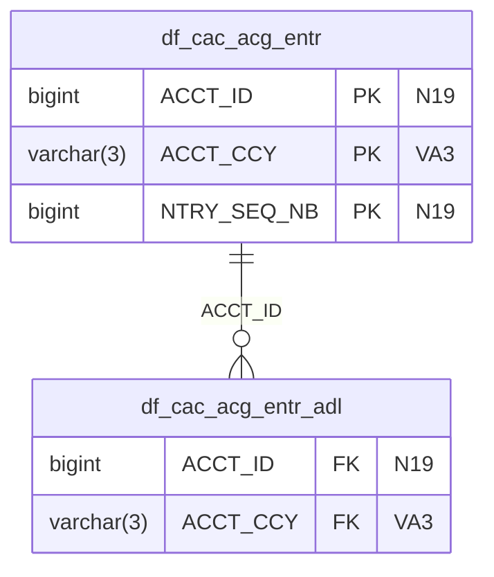

# Usage Guide

## Overview

This solution is an Excel- or YAML-config-driven synthetic data generator that can:

- generate related parquet snapshot data from an Excel workbook
- preserve table relationships during fallback generation
- attempt SDV multi-table synthesizer training on every `generate` run
- fall back to deterministic rule-based generation when SDV fit or SDV sampling is not usable
- generate parquet delta outputs between two snapshots
- expand snapshot data into SCD2 history outputs
- support both legacy and newer simplified workbook formats

The project is **Excel-first**, with YAML available as a config-as-code option:

- **legacy Excel mode**: only the `Columns` sheet is required
- **new Excel mode**: `Columns` is still required, and the runtime can additionally use `Run_Settings`, `Tables`, and `Relationships`
- **YAML mode**: a canonical YAML file can define `run_settings`, `tables[].columns[]`, and optional `relationships`

---

## Supported configuration formats

### 1. Legacy workbook
Only this sheet is required:

- `Columns`

This keeps older configurations working without forcing a migration.

### 2. New workbook
Recommended simplified structure:

- `Run_Settings`
- `Tables`
- `Columns`
- `Relationships`

Only `Columns` is mandatory at runtime.
The other sheets are optional but recommended if you want the full newer configuration model.

This format adds support for:

- per-table row counts
- active/inactive tables
- business keys and primary keys
- delta eligibility
- SCD2 enablement
- tracked SCD2 columns
- relationship definitions
- optional runtime settings such as model artifact saving and sample size

### 3. YAML configuration

YAML is supported as a parser-friendly alternative to Excel.

Recommended top-level sections:

- `run_settings`
- `tables`
- `relationships`

Each table should define:

- `name`
- optional table-level metadata such as `row_count`, `generation_mode`, `primary_key_columns`, `business_key_columns`
- `columns`, where each column defines fields equivalent to the Excel `Columns` sheet

The YAML loader normalizes the config into the same internal model used for Excel, so the generation, delta, and SCD2 logic remains unchanged.

See `Yaml_Config_Schema.md` for the canonical runtime schema.

---

## Core features

### Snapshot generation
Creates parquet files for active tables defined in the workbook.

### Relationship-aware generation
The generator preserves configured parent/child relationships in fallback generation and performs a final foreign-key resolution pass before export.

### SDV metadata creation
The project builds SDV metadata from the workbook using SDV's newer `Metadata` API.

### Synthesizer training
During `generate`, the solution attempts to train `HMASynthesizer` using internally generated sample data.

### Delta generation
Compares two parquet snapshot folders and writes only inserted, updated, and deleted rows.

### SCD2 generation
Builds history-style parquet outputs with effective dating and version columns.

### Backward compatibility
The CLI supports both:

- legacy invocation without a subcommand
- new explicit subcommands

---

## Command summary

There are four runtime commands:

- `generate`
- `delta`
- `scd2`
- `collibra-import`

The CLI also supports a **legacy compatibility mode** where omitting the subcommand is treated as `generate`.

---

## 1. Legacy execution style

If you run `main.py` without a subcommand, the CLI automatically treats it as `generate`.

### Example
```zsh
python main.py --config config/Acct_bkng.xlsx --output output/legacy_run
```

Equivalent explicit command:

```zsh
python main.py generate --config config/Acct_bkng.xlsx --output output/legacy_run
```

Use this if older scripts, pipeline steps, or users are still calling the tool in the original style.

---

## 2. New explicit snapshot generation command

### Basic generate command
```zsh
python main.py generate --config config/Acct_bkng.xlsx --output output/run_01
```

### With default record count override
```zsh
python main.py generate --config config/Acct_bkng.xlsx --output output/run_01 --default-records 1000
```

### With table-specific overrides
```zsh
python main.py generate \
  --config config/Acct_bkng.xlsx \
  --output output/run_01 \
  --records df_cac_acg_entr:5000 df_cash_bookg:1200
```

### With relationship validation after generation
```zsh
python main.py generate \
  --config config/Acct_bkng.xlsx \
  --output output/run_01 \
  --validate
```

### With verbose logging
```zsh
python main.py generate \
  --config config/Acct_bkng.xlsx \
  --output output/run_01 \
  --verbose
```

### Streaming flag
```zsh
python main.py generate \
  --config config/Acct_bkng.xlsx \
  --output output/run_01 \
  --stream \
  --chunk-size 100000
```

> Note: the CLI exposes `--stream`, but the current generator build only uses true streaming if a dedicated streaming method exists. Otherwise it logs a warning and falls back to standard generation.

---

## 3. Delta generation command

Delta is a **separate post-processing command**. It does not generate data from Excel directly. It compares two parquet snapshot folders and writes a **real Delta Lake table** per eligible output table.

### Basic delta command
```zsh
python main.py delta \
  --config config/Acct_bkng.xlsx \
  --previous output/snapshot_old \
  --current output/snapshot_new \
  --output output/delta_run
```

### Restrict delta to selected tables
```zsh
python main.py delta \
  --config config/Acct_bkng.xlsx \
  --previous output/snapshot_old \
  --current output/snapshot_new \
  --output output/delta_run \
  --tables df_cac_acg_entr df_cash_bookg
```

### Override delta partition naming from the CLI
```zsh
python main.py delta \
  --config config/Acct_bkng.xlsx \
  --previous output/snapshot_old \
  --current output/snapshot_new \
  --output output/delta_run \
  --partition-column batch_partition_date
```

Or provide multiple partition columns when your delta dataframe already contains them:

```zsh
python main.py delta \
  --config config/Acct_bkng.xlsx \
  --previous output/snapshot_old \
  --current output/snapshot_new \
  --output output/delta_run \
  --partition-columns country_code batch_partition_date
```

### What delta writes
For each eligible table, delta is written as a Delta Lake table in a folder layout like this:

```text
<delta_output_root>/
  <table_name>/
    _delta_log/
      00000000000000000000.json
      00000000000000000001.json
      ...
    <partition_column>=<value>/
      part-00001-<uuid>-c000.snappy.parquet
    <partition_column>=<value2>/
      part-00002-<uuid>-c000.snappy.parquet
```

The `_delta_log` JSON files are Delta Lake transaction logs and contain entries such as `protocol`, `metaData`, `add`, `remove`, and `commitInfo`.

Each active Delta data file contains the changed rows with an operation column (`I` = insert, `U` = update, `D` = delete). By default the operation column is named `operation_type`.

---

### Partition folder naming

The partition folder name has the form `<partition_column>=<value>`. Understanding how the column and value are chosen is essential to getting clean, predictable output.

#### Resolution order — which column is used

The runtime resolves the partition column for each table in this order:

| Priority | Source | Where to set it |
|---|---|---|
| 1 (highest) | `partition_columns` on the table | `Tables` sheet or `tables[].partition_columns` in YAML |
| 2 | `delta_partition_columns` in run settings | `Run_Settings` sheet or `run_settings.delta_partition_columns` in YAML |
| 3 | `delta_partition_column` in run settings | `Run_Settings` sheet or `run_settings.delta_partition_column` in YAML |
| 4 (default) | `edl_partition_date` | automatic fallback — no config needed |

Only one source is used per table. The first source that provides a non-empty value wins.

#### Two behaviours depending on whether the column exists in the data

**Case 1 — partition column already exists as a data column**

If the resolved partition column is a column that was generated and appears in the snapshot parquet files, the runtime uses the **actual data values** from that column as the partition folder values.

Example: a table configured with `partition_columns: [YEAR_MONTH]` where `YEAR_MONTH` is an `N6` column. The folder names will be `YEAR_MONTH=202301`, `YEAR_MONTH=202405`, etc., taken directly from the generated rows.

What this means for you:
- The column must contain values that are valid as filesystem folder names.
- If the column is purely numeric (e.g. `N6`) with no range constraint, the generator will produce random 6-digit integers that may look like garbage (`YEAR_MONTH=100016`). **Always set `min_value`/`max_value` on the column** so the generated values fall in the expected range.
- Every distinct value in that column becomes a separate partition folder. If 100 rows all have distinct `YEAR_MONTH` values, you get 100 partition folders each containing one file.

**Case 2 — partition column does not exist in the data**

If the resolved partition column is not present in the snapshot parquet files, the runtime **auto-injects** it. A single value is assigned to all rows in that delta run, written as a new column in the output.

The injected value is chosen as follows:

1. If the delta output folder already exists and has previous partition sub-folders for this column, the new value is the **next day** after the latest existing partition date.
2. If `delta_partition_start_date` is set in run settings, that date is used for the first run.
3. Otherwise the current UTC date in `YYYYMMDD` format is used.

This is the behaviour you see with the default `edl_partition_date`: every row in the delta output gets `edl_partition_date=20260502` (today), and on the next run it becomes `edl_partition_date=20260503`.

---

#### Configuring partition columns — Excel

In the **`Tables` sheet**, fill the `partition_columns` cell for the table. Use a semicolon-separated list for multiple columns:

```
partition_columns = YEAR_MONTH
partition_columns = country_code;load_date
```

In the **`Columns` sheet**, add `min_value` and `max_value` to any numeric partition column to keep values in a sensible range:

```
column_name = YEAR_MONTH   data_type = N6   min_value = 202001   max_value = 202612
```

For date-typed partition columns (`D`, `DT`, `TS`) you can also set date string bounds:

```
column_name = LOAD_DT   data_type = D   min_value = 2023-01-01   max_value = 2025-12-31
```

---

#### Configuring partition columns — YAML

At the **table level**:

```yaml
tables:
  - name: df_cac_acg_entr
    partition_enabled: true
    partition_columns: [YEAR_MONTH]
    columns:
      - name: YEAR_MONTH
        type: N6
        min: 202001        # generates values like 202304, 202507 — not garbage
        max: 202612
        nullable: true
```

Using a **date column** as the partition key:

```yaml
  - name: fx_rates_2100cet
    partition_columns: [RATEDATE]
    columns:
      - name: RATEDATE
        type: D
        min: "2023-01-01"
        max: "2025-12-31"
        pk: true
```

Setting a **global fallback** partition column in run settings (used for tables that do not specify `partition_columns`):

```yaml
run_settings:
  delta_partition_column: load_date
  delta_partition_start_date: "2026-01-01"
```

---

#### Resulting folder structure examples

Table with `YEAR_MONTH` in range `202001–202612` (Case 1 — column exists in data):

```text
delta_run/df_cac_acg_entr/
  YEAR_MONTH=202104/
    part-00000-<uuid>-c000.snappy.parquet
  YEAR_MONTH=202209/
    part-00000-<uuid>-c000.snappy.parquet
  YEAR_MONTH=202501/
    part-00000-<uuid>-c000.snappy.parquet
  _delta_log/
    00000000000000000000.json
```

Table with no `partition_columns` configured — auto-injected `edl_partition_date` (Case 2):

```text
delta_run/df_cac_acg_entr_adl/
  edl_partition_date=20260502/
    part-00000-<uuid>-c000.snappy.parquet
  _delta_log/
    00000000000000000000.json
```

Second run on the same output folder (date advances by one day):

```text
delta_run/df_cac_acg_entr_adl/
  edl_partition_date=20260502/        ← previous run (still in Delta log as removed)
  edl_partition_date=20260503/        ← new active partition
  _delta_log/
    00000000000000000000.json
    00000000000000000001.json
```

---

#### Common mistakes and fixes

| Symptom | Cause | Fix |
|---|---|---|
| `YEAR_MONTH=100016` — nonsense partition names | `N6` column with no range constraint; random integers generated | Add `min: 202001` and `max: 202612` to the column |
| Hundreds of partition folders (one per row) | Data column used as partition key but has unique values per row | Use a column with a small cardinality (year-month, region code, etc.) |
| `edl_partition_date=20260502` appears unexpectedly | No `partition_columns` configured for the table; runtime used the default fallback | Either accept it, or configure `partition_columns` for the table |
| All rows land in a single partition folder | Auto-injected partition column — all rows share the same injected date value | Expected for auto-injection; configure a data column as partition key if you want row-level fan-out |

---

Run-settings keys that affect delta partitioning:

| Key | Effect |
|---|---|
| `operation_column` | Rename the `I`/`U`/`D` operation column (default: `operation_type`) |
| `delta_partition_column` | Fallback partition column name when no table-level `partition_columns` is set |
| `delta_partition_columns` | Semicolon-separated list of fallback partition columns |
| `delta_partition_start_date` | Starting date for the auto-injected partition value on the first run |

### What happens if you reuse the same delta output folder
If you run `delta` again and pass the **same output folder path**:

- the existing Delta table is overwritten as a new Delta version
- a new transaction JSON file is added inside `_delta_log`
- the transaction log records `remove` actions for the prior active files and `add` actions for the new active files
- if the partition column is runtime-generated, the new partition date is chosen as the **next day after the latest existing partition** for that table

So repeated delta runs preserve Delta history while replacing the active table state with the latest delta snapshot.

### Reading delta output locally
You can inspect either a single table root or the entire delta output root with the local reader:

```zsh
poetry run python readParquet.py output/account_booking_delta
```

To inspect just one table and force a specific partition column name:

```zsh
poetry run python readParquet.py output/account_booking_delta/df_cac_acg_entr --partition-column edl_partition_date
```

When you point the script at the delta output root, it prints the row count for every table and a grand total across the whole delta folder.

### Which tables are processed in delta
A table is included if all of the following are true:

- it is active
- it is marked `delta_eligible = True`
- it is selected by `--tables` if that filter is provided

### How keys are chosen for delta
The processor resolves key columns in this order:

1. `business_key_columns` from `Tables`
2. column-level `is_business_key_component`
3. `primary_key_columns`
4. `is_pk` columns

If no business or primary keys are available, delta processing fails for that table.

---

## 4. SCD2 generation command

SCD2 is also a **separate post-processing command**. It compares snapshots and builds versioned history parquet outputs.

### Basic SCD2 command
```zsh
python main.py scd2 \
  --config config/Acct_bkng.xlsx \
  --previous output/snapshot_old \
  --current output/snapshot_new \
  --output output/scd2_run
```

### Restrict SCD2 to selected tables
```zsh
python main.py scd2 \
  --config config/Acct_bkng.xlsx \
  --previous output/snapshot_old \
  --current output/snapshot_new \
  --output output/scd2_run \
  --tables oktb_250
```

### Provide explicit effective timestamps
```zsh
python main.py scd2 \
  --config config/Acct_bkng.xlsx \
  --previous output/snapshot_old \
  --current output/snapshot_new \
  --output output/scd2_run \
  --effective-ts "2026-04-22 10:00:00" \
  --previous-effective-ts "2026-04-21 10:00:00"
```

### What SCD2 writes
The SCD2 parquet output adds these columns:

- `effective_from_ts`
- `effective_to_ts`
- `is_current`
- `version_num`

### Which tables are processed in SCD2
A table is included if all of the following are true:

- it is active
- it is marked `scd2_enabled = True`
- it is selected by `--tables` if that filter is provided

### How tracked columns are chosen for SCD2
Tracked columns are resolved in this order:

1. `scd2_tracked_columns` from `Tables`
2. column-level `scd2_tracked = True`
3. all non-business-key columns

### How the previous snapshot is interpreted
- If the previous parquet already contains SCD2 columns, it is treated as existing history.
- If it does not, the processor bootstraps the previous snapshot into SCD2 history with version `1`.

---

## Synthesizer fitting behavior

## Important rule
The synthesizer is **attempted on every `generate` run**.

That means:

- `generate` -> tries to fit SDV
- `delta` -> does **not** fit SDV
- `scd2` -> does **not** fit SDV

### Fit flow during `generate`
The runtime sequence is:

1. load workbook
2. parse tables and relationships
3. create SDV metadata
4. generate internal sample data
5. train `HMASynthesizer`
6. if fit succeeds, try SDV-based generation
7. if fit fails, use fallback generation

### Retry behavior
The fit logic tries twice:

1. first fit with sanitized sample data
2. retry with more aggressive sanitization if the first attempt fails

### Sample size used for fit
The fit process reads:

- `synthesizer_sample_size` from `Run_Settings` if present

Internally:

- first attempt uses up to `min(sample_size, 100)` rows per table
- retry attempt uses up to `max(25, min(sample_size, 75))` rows per table

### When `is_fitted` becomes true
`is_fitted = True` only when SDV training succeeds.

### When fallback generation is used
Fallback generation is used when:

- metadata creation or fit does not produce a usable trained synthesizer
- the initial fit fails and the retry also fails
- SDV sampling later fails during data generation
- SDV returns invalid or unusable generated output

### Practical interpretation
So the most accurate statement is:

> The solution always attempts to fit the synthesizer during `generate`, but it preserves fallback generation so the run can continue if SDV fit or SDV sampling is not usable.

---

## What “Preprocess Tables” means during synthesizer training

When SDV logs messages such as:

- `Preprocess Tables`
- `Fitting table ... metadata`
- `Fitting formatters ...`
- `Fitting HyperTransformer ...`

it means SDV is preparing the sample data before learning statistical patterns.

### Plain-language explanation
The generator does **not** train SDV on the final requested output size directly.
Instead, it first creates a smaller internal sample dataset from your Excel configuration and uses that sample to teach SDV the structure of the tables.

During **Preprocess Tables**, SDV is essentially doing the following:

1. reading each table in the sample dataset
2. checking each column type using the metadata
3. converting values into forms SDV can model safely
4. learning how to transform raw values into model-friendly numerical representations
5. preparing parent/child table structure before statistical training starts

### In this project specifically
Before SDV receives the sample data, this solution already sanitizes it by:

- coercing date/time values into safe timestamp ranges
- normalizing identifier columns for keys and foreign keys
- converting numeric columns with `pd.to_numeric`
- filling certain invalid or missing values more aggressively on retry
- re-applying supported relationships in the sample data

So by the time SDV says `Preprocess Tables`, it is working on a sample that has already been cleaned once by your generator.

### What SDV learns from the sample
From that sample, SDV learns patterns such as:

- typical value distributions
- approximate ranges and formats
- categorical tendencies
- null behavior that appears in the sample
- table structure and supported parent/child dependencies

### What it does **not** mean
`Preprocess Tables` does **not** mean:

- parquet export has started
- final output files are being written
- the full requested volume has been generated yet

It is a **training preparation phase**, not the final data creation phase.

### Why this stage matters
If the sample contains problematic data types, unsupported shapes, impossible ranges, or columns SDV cannot transform safely, failures often appear during or just after `Preprocess Tables`.

That is why this solution:

- sanitizes sample data first
- retries fitting with more aggressive cleaning
- keeps fallback generation available

---

---

## 5. ER diagram generation

After generating a snapshot you can automatically produce an Entity-Relationship diagram that shows every table, its columns, and the FK relationships between them.

### Flags

| Flag | Description | Default |
|---|---|---|
| `--er-diagram` | Enable ER diagram generation | off |
| `--er-format` | Space-separated list: `mermaid`, `dot`, `png` | `mermaid` |
| `--er-output` | Directory to write diagram files | same as `--output` |

### Examples

```zsh
# Mermaid only (default — zero extra dependencies)
python main.py generate --config config/Acct_bkng.xlsx --output output/run_01 --er-diagram

# Mermaid + Graphviz DOT
python main.py generate --config config/Acct_bkng.xlsx --output output/run_01 \
    --er-diagram --er-format mermaid dot

# All formats including PNG (requires: pip install matplotlib)
python main.py generate --config config/Acct_bkng.xlsx --output output/run_01 \
    --er-diagram --er-format mermaid dot png

# Write diagrams to a separate folder
python main.py generate --config config/Acct_bkng.xlsx --output output/run_01 \
    --er-diagram --er-output docs/diagrams
```

### Output files

| Format | File | How to open |
|---|---|---|
| Mermaid | `er_diagram.mmd` | VS Code (Mermaid Preview extension), GitHub (renders in README), [mermaid.live](https://mermaid.live) |
| DOT | `er_diagram.dot` | Graphviz (`dot -Tpng er_diagram.dot -o er.png`), VS Code (Graphviz Preview) |
| PNG | `er_diagram.png` | Any image viewer — generated via matplotlib/networkx |

### Mermaid example output (abbreviated)



---

## 6. Cloud upload

After generation you can upload the entire output directory to Azure Blob Storage or AWS S3 in a single command using the `--upload-to` flag.

### Syntax

```
--upload-to azure://<container>[/<prefix>]
--upload-to s3://<bucket>[/<prefix>]
```

### Examples

```zsh
# Upload to Azure Blob Storage
python main.py generate --config config/Acct_bkng.xlsx --output output/run_01 \
    --upload-to azure://my-container/synthetic/run_01

# Upload to AWS S3
python main.py generate --config config/Acct_bkng.xlsx --output output/run_01 \
    --upload-to s3://my-data-bucket/synthetic/run_01

# Combined: generate + ER diagram + cloud upload in one command
python main.py generate --config config/Acct_bkng.xlsx --output output/run_01 \
    --er-diagram --upload-to s3://my-data-bucket/run_01
```

### Azure credentials

Set one of these environment variable combinations before running:

| Priority | Variables |
|---|---|
| 1 (preferred) | `AZURE_STORAGE_CONNECTION_STRING` |
| 2 | `AZURE_STORAGE_ACCOUNT` + `AZURE_STORAGE_KEY` |
| 3 | `AZURE_STORAGE_ACCOUNT` + `AZURE_STORAGE_SAS_TOKEN` |

```zsh
set AZURE_STORAGE_CONNECTION_STRING=DefaultEndpointsProtocol=https;AccountName=...
python main.py generate --config ... --output out/ --upload-to azure://my-container/path
```

### AWS credentials

Use any standard AWS credential method — the uploader calls `boto3` which respects the full AWS credential chain:

| Method | How |
|---|---|
| Environment variables | `AWS_ACCESS_KEY_ID` + `AWS_SECRET_ACCESS_KEY` + `AWS_DEFAULT_REGION` |
| Named profile | `AWS_PROFILE=myprofile` |
| IAM role | Automatic on EC2, ECS, Lambda — no env vars needed |

```zsh
set AWS_ACCESS_KEY_ID=AKIA...
set AWS_SECRET_ACCESS_KEY=...
set AWS_DEFAULT_REGION=eu-west-1
python main.py generate --config ... --output out/ --upload-to s3://my-bucket/path
```

### Install optional SDK

```zsh
pip install azure-storage-blob   # Azure support
pip install boto3                # AWS S3 support
```

---

## 7. Collibra data catalog import

Instead of authoring an Excel or YAML config by hand, you can pull dataset definitions directly from your Collibra data catalog and generate a ready-to-use YAML config file.

### Prerequisites

```zsh
pip install requests   # already in core dependencies
set COLLIBRA_BASE_URL=https://your-org.collibra.com
set COLLIBRA_USERNAME=service-account
set COLLIBRA_PASSWORD=secret
```

### Command

```zsh
python main.py collibra-import \
    --dataset "Account Booking" \
    --output config/from_collibra.yaml
```

### All flags

| Flag | Description | Default |
|---|---|---|
| `--dataset` | Dataset / table name to search for in Collibra (required) | — |
| `--output` | Path to write the generated YAML config | `config/collibra_import.yaml` |
| `--asset-type` | Collibra asset type to match | `Data Set` |
| `--domain` | Narrow search to a specific Collibra domain | all domains |
| `--base-url` | Override `COLLIBRA_BASE_URL` env var | env var |
| `--verbose` | Enable debug logging | off |

### More examples

```zsh
# Import from a specific domain
python main.py collibra-import \
    --dataset "Customer Master" \
    --domain "Finance" \
    --output config/customer_master.yaml

# Import with custom asset type
python main.py collibra-import \
    --dataset "FX Rates" \
    --asset-type "Table" \
    --output config/fx_rates.yaml
```

### Then generate data from the imported config

```zsh
python main.py generate \
    --config config/from_collibra.yaml \
    --output output/snapshot_v1 \
    --default-records 1000
```

### What gets imported

| Collibra attribute | Maps to |
|---|---|
| Column display name | `name` |
| Physical Data Type / Data Type | `type` (mapped to platform type codes) |
| Nullable / Is Nullable | `nullable` |
| Is Primary Key / Primary Key | `pk: true` |
| Description / Technical Description | `description` |

### Collibra type → platform type mapping

| Collibra type | Platform type |
|---|---|
| varchar, varchar2, text, clob | `VA256` |
| char, nchar | `A` |
| integer, int, number | `N19` |
| bigint | `N38` |
| smallint | `N6` |
| numeric, decimal, float, double | `DC` |
| date | `D` |
| datetime | `DT` |
| timestamp (with or without tz) | `TS` |
| boolean, bit | `A1` |

> **Note:** Collibra relation type UUIDs for table→column relationships vary between Collibra instances. The importer tries the two most common UUIDs automatically. If no columns are found, check your Collibra instance's `GET /rest/2.0/relationTypes` endpoint for the correct UUID and extend `_fetch_columns` in `utils/collibra_importer.py`.

---

## 8. Global data generation — special rules reference

The `special_rules` column (Excel) or `special_rules:` field (YAML) accepts a keyword that controls how values are generated. Many rules accept a locale suffix (e.g. `NAME:de_DE`) and there are `GLOBAL_*` variants that pick a random locale on every row.

### Locale suffix syntax

```
RULE            → uses default locale (nl_NL)
RULE:de_DE      → always German locale
RULE:GLOBAL     → random locale per row from 18 supported locales
```

### Faker-backed personal data

| Rule | Example output | Notes |
|---|---|---|
| `NAME` | Jan de Vries | Full name |
| `FIRST_NAME` | Jan | |
| `LAST_NAME` | de Vries | |
| `EMAIL` | jan@example.nl | |
| `PHONE` | +31612345678 | |
| `ADDRESS` | Hoofdstraat 1, Amsterdam | |
| `COMPANY` | Acme Solutions B.V. | |
| `NAME:de_DE` | Hans Müller | German locale |
| `NAME:fr_FR` | Jean Dupont | French locale |
| `GLOBAL_NAME` | random locale per row | |
| `GLOBAL_ADDRESS` | random locale per row | |
| `GLOBAL_COMPANY` | random locale per row | |

**Supported locales:** `en_US`, `en_GB`, `en_AU`, `en_CA`, `de_DE`, `fr_FR`, `es_ES`, `it_IT`, `nl_NL`, `pt_BR`, `ja_JP`, `zh_CN`, `ko_KR`, `ru_RU`, `pl_PL`, `tr_TR`, `sv_SE`, `da_DK`

### Banking & financial identifiers

| Rule | Example output | Coverage |
|---|---|---|
| `IBAN` | NL91ABNA0417164300 | All SEPA countries (auto-selects valid country prefix) |
| `IBAN:de_DE` | DE89370400440532013000 | Specific country IBAN |
| `SWIFT` / `BIC` | ABNANL2A | International — any bank worldwide |
| `US_ROUTING` | 021000021 | ABA routing number (9 digits) |
| `US_ACCOUNT` | 1234567890 | US bank account number |
| `UK_SORTCODE` | 20-00-00 | UK sort code |
| `UK_ACCOUNT` | 12345678 | UK account number |
| `AU_BSB` | 062-000 | Australian BSB code |
| `IN_IFSC` | SBIN0000001 | Indian IFSC code |
| `CLABE` | 646180110400000007 | Mexican CLABE (18 digits) |
| `CA_TRANSIT` | 00610-003 | Canadian transit number |

### National identifiers

| Rule | Example output | Country |
|---|---|---|
| `SSN` | 123-45-6789 | US Social Security Number |
| `US_EIN` | 12-3456789 | US Employer Identification Number |
| `UK_NI` | AB123456C | UK National Insurance |
| `IN_PAN` | ABCDE1234F | India PAN card |
| `IN_AADHAAR` | 1234 5678 9012 | India Aadhaar (12 digits) |
| `AU_TFN` | 123 456 782 | Australia Tax File Number |
| `AU_ABN` | 51 824 753 556 | Australia Business Number |
| `BR_CPF` | 111.444.777-35 | Brazil individual tax ID |
| `BR_CNPJ` | 11.222.333/0001-81 | Brazil company tax ID |
| `FR_SIREN` | 123456789 | France company ID (9 digits) |
| `FR_SIRET` | 12345678900012 | France establishment ID (14 digits) |
| `DE_TAX` | 1234567890 | Germany tax number |
| `ZA_ID` | 8001015009087 | South Africa ID number |
| `SG_NRIC` | S1234567D | Singapore NRIC |

### Passports & government documents

| Rule | Example output | Notes |
|---|---|---|
| `PASSPORT` | A12345678 | Random country passport format |
| `PASSPORT:US` | 123456789 | US passport |
| `PASSPORT:DE` | C01X00T47 | German passport |
| `DRIVERS_LICENCE` | AB123456 | Random country driving licence |
| `DRIVERS_LICENCE:US` | D123-4567-8901 | US driving licence |

### Tax & VAT numbers

| Rule | Example output | Notes |
|---|---|---|
| `EU_VAT` | DE123456789 | EU VAT number (random member state) |
| `EU_VAT:FR` | FR12345678901 | French VAT |
| `GSTIN` | 27AAPFU0939F1ZV | Indian GST Identification Number |

### Network & technical identifiers

| Rule | Example output |
|---|---|
| `IPV4` | 192.168.1.42 |
| `IPV6` | 2001:db8::1 |
| `MAC` | 00:1A:2B:3C:4D:5E |
| `UUID` | 550e8400-e29b-41d4-a716-446655440000 |
| `URL` | https://example.com/path |

### Healthcare identifiers

| Rule | Example output | Country |
|---|---|---|
| `NHS_NUMBER` | 943 476 5919 | UK NHS number |
| `AU_MEDICARE` | 2123456701 | Australia Medicare number |
| `DE_KRANKENVERSICHERUNG` | A123456780 | German health insurance number |
| `US_NPI` | 1234567893 | US National Provider Identifier |

### Cryptocurrency addresses

| Rule | Example output |
|---|---|
| `BTC_ADDRESS` | 1A1zP1eP5QGefi2DMPTfTL5SLmv7Divf... |
| `ETH_ADDRESS` | 0xAbCd1234... |
| `SOL_ADDRESS` | base58 Solana public key |

### Product & barcode identifiers

| Rule | Example output |
|---|---|
| `EAN13` | 5901234123457 |
| `EAN8` | 96385074 |
| `UPC_A` | 012345678905 |
| `ISBN13` | 9780306406157 |
| `CN_USCC` | 91110000600099792F |

### YAML config example using global rules

```yaml
tables:
  - name: customers
    rows: 1000
    columns:
      - name: CUSTOMER_ID
        type: N19
        pk: true
      - name: FULL_NAME
        type: VA256
        special_rules: GLOBAL_NAME
      - name: EMAIL
        type: VA256
        special_rules: EMAIL
      - name: IBAN
        type: VA34
        special_rules: IBAN
      - name: PASSPORT_NO
        type: VA20
        special_rules: PASSPORT
      - name: TAX_ID
        type: VA20
        special_rules: EU_VAT
```

### Excel config example

In the `special_rules` column of the Columns sheet:

| TABLE_NAME | COLUMN_NAME | DATA_TYPE | special_rules |
|---|---|---|---|
| customers | FULL_NAME | VA256 | GLOBAL_NAME |
| customers | IBAN | VA34 | IBAN |
| customers | PASSPORT | VA20 | PASSPORT:US |
| customers | EU_VAT | VA20 | EU_VAT:DE |

---

## End-to-end examples

## Example A: legacy-style snapshot generation
```zsh
python main.py --config config/Acct_bkng.xlsx --output output/account_booking_snapshot
```

## Example B: new explicit snapshot generation
```zsh
python main.py generate --config config/Acct_bkng.xlsx --output output/account_booking_snapshot
```

## Example C: snapshot generation with row override and validation
```zsh
python main.py generate \
  --config config/Acct_bkng.xlsx \
  --output output/account_booking_snapshot \
  --default-records 500 \
  --validate
```

## Example D: delta from two snapshots
```zsh
python main.py delta \
  --config config/Acct_bkng.xlsx \
  --previous output/account_booking_snapshot_v1 \
  --current output/account_booking_snapshot_v2 \
  --output output/account_booking_delta
```

## Example E: SCD2 from two snapshots
```zsh
python main.py scd2 \
  --config config/Acct_bkng.xlsx \
  --previous output/account_booking_snapshot_v1 \
  --current output/account_booking_snapshot_v2 \
  --output output/account_booking_scd2
```

## Example F: generate with ER diagram + cloud upload
```zsh
python main.py generate \
  --config config/Acct_bkng.xlsx \
  --output output/run_01 \
  --default-records 1000 \
  --er-diagram --er-format mermaid dot \
  --upload-to s3://my-data-bucket/synthetic/run_01
```

## Example G: Collibra import then generate
```zsh
# Step 1: pull config from Collibra
python main.py collibra-import \
  --dataset "Account Booking" \
  --domain "Finance" \
  --output config/account_booking_collibra.yaml

# Step 2: generate data from imported config
python main.py generate \
  --config config/account_booking_collibra.yaml \
  --output output/run_01 \
  --default-records 5000 \
  --er-diagram
```

## Example H: global customer data with banking and ID rules (YAML)
```yaml
tables:
  - name: global_customers
    rows: 2000
    columns:
      - name: CUSTOMER_ID
        type: N19
        pk: true
      - name: FULL_NAME
        type: VA256
        special_rules: GLOBAL_NAME
      - name: EMAIL
        type: VA256
        special_rules: EMAIL
      - name: PHONE
        type: VA20
        special_rules: GLOBAL_PHONE
      - name: IBAN
        type: VA34
        special_rules: IBAN
      - name: SWIFT
        type: VA11
        special_rules: SWIFT
      - name: PASSPORT_NO
        type: VA20
        special_rules: PASSPORT
      - name: TAX_REFERENCE
        type: VA20
        special_rules: EU_VAT
      - name: IP_ADDRESS
        type: VA45
        special_rules: IPV4
```

---

## Useful workbook settings

Common `Run_Settings` values include:

- `default_records_per_table`
- `operation_column`
- `synthesizer_sample_size`
- `save_model_artifact`
- `model_artifact_path`

Common `Tables` controls include:

- `row_count`
- `generation_mode`
- `business_key_columns`
- `primary_key_columns`
- `delta_eligible`
- `scd2_enabled`
- `scd2_tracked_columns`
- `active`

Common `Columns` controls include:

- `is_pk`
- `is_fk`
- `business_values`
- `special_rules`
- `min_value`
- `max_value`
- `nullable`
- `is_business_key_component`
- `event_time`
- `scd2_tracked`

---

## Current operational notes

- Composite keys are supported by the generator logic, delta flow, and SCD2 flow.
- SDV metadata supports only a subset of relationship patterns cleanly, so unsupported composite SDV relationships are skipped for SDV metadata while still being preserved for fallback/delta/SCD2 logic.
- The generator attempts SDV training every `generate` run, but fallback generation remains the safety net.
- Model artifacts can be saved when enabled in `Run_Settings`.

---

## Recommended execution order

### For normal snapshot generation
```zsh
python main.py generate --config <workbook.xlsx> --output <snapshot_dir>
```

### For delta after two snapshots exist
```zsh
python main.py delta --config <workbook.xlsx> --previous <old_snapshot_dir> --current <new_snapshot_dir> --output <delta_dir>
```

### For SCD2 after two snapshots exist
```zsh
python main.py scd2 --config <workbook.xlsx> --previous <old_snapshot_dir> --current <new_snapshot_dir> --output <scd2_dir>
```

---

## Quick decision guide

### Use legacy command if:
- you want existing scripts to keep working unchanged

### Use explicit `generate` if:
- you want clearer, future-proof command usage

### Use `delta` if:
- you want inserts/updates/deletes between two snapshot folders

### Use `scd2` if:
- you want historized versioned outputs for SCD2-enabled tables

---

## One-line summary

This solution is an Excel-driven synthetic data generator that supports legacy and modern workbook styles, attempts SDV synthesizer fitting on every snapshot generation run, preserves fallback generation for reliability, and adds separate parquet post-processing commands for delta and SCD2 history generation.

